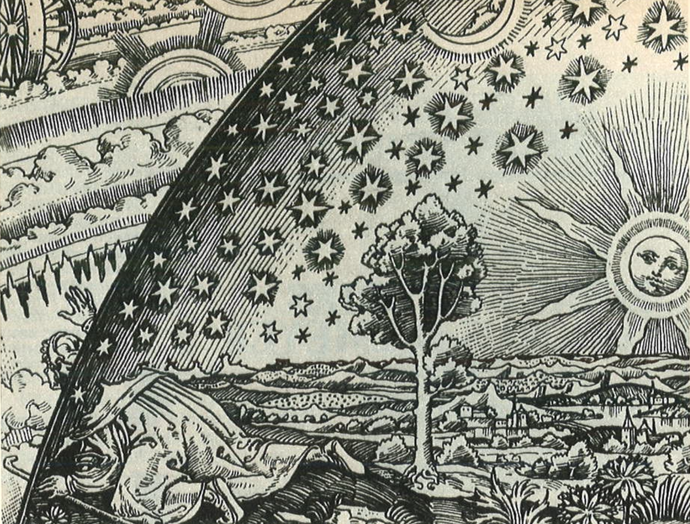
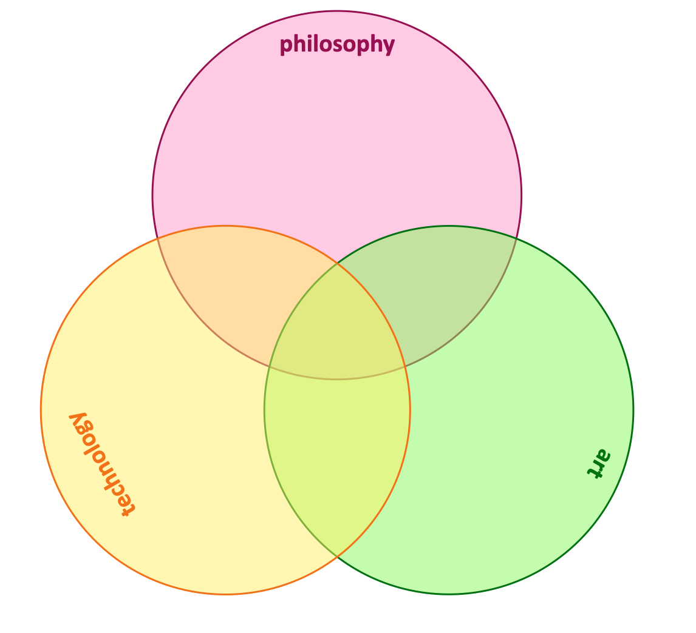

# General background information

## Introduction

A few days after his death in May 1976, the German weekly *Der Spiegel* [published an interview with Martin Heidegger](files/Heidegger-Spiegel-31-05-1976.pdf) which was recorded ten years earlier. Though at the time this interview was mostly noted for Heiddeger's explanations for his membership of the NSDAP in the 1930's, actually the most interesting part comes when he talks about the relationship between man and contemporary technology. Where in 1954 he was still looking for a 'free relation* (*freie Beziehung*) between man and technology, now he states the opinion that the dynamics of technology is completely independent of human control – a development which, according to Heidegger, perhaps even requires a different setup of our complete society:

=== "Deutch"

    > Inzwischen dürfte in den vergangenen dreißig Jahre deutlicher geworden sein, daß die planetarische Bewegung der neuzeitlichten Technik eine Macht ist, deren Geschichte-bestimmende Größe kaum überschätzt werden kann. Es is für mich heute eine entscheidende Frage, wie dem technische Zeitalter überhaupt ein – und welches – politisches System zogeordnet werden kann. Auf diese Frage weiß ich keine Antwort. Ich bin nicht überzeugt, daß es die Demokratie ist.

=== "English translation"

    > Meantime, the last 30 years have made it clearer that the planet-wide movement of modern technicity is a power whose magnitude in determining [our] history can hardly be overestimated. For me today it is a decisive question as to how any political system -- and which one -- can be adapted to an epoch of technicity. I know of no answer to this question. I am not convinced that it is democracy. 

This litte quote contains a lot of the subject-matters that form this caput *Art and Technology (and Philosophy)*. The background of it is that technology is increasingly seen as the sole foundation of truth and knowledge. In modern times, technology, as a physical manifestation of science, is seen as the only source of *real knowledge*. 

## Different kinds of knowledge

We moderns (sure, [we have never been modern](https://fr.wikipedia.org/wiki/Nous_n%27avons_jamais_%C3%A9t%C3%A9_modernes), but still) tend to view art and technology as separate fields of human andeavour, and philosophy as some vague enterprise that has litte to do with everyday life. 

However, before modern times, these fields of knowledge formed one complete whole, the word 'Art' in singular and with a capital A emerging only in the wake of [the Scientific Revolution](https://en.wikipedia.org/wiki/Scientific_Revolution). This whole was at center stage for most of the historical period. On this stage, art, technology and philosophy danced together in mutual harmony in order to explain and predict natural phenomena, to create and develop understanding, and to keep order in the world.

And even today, most fruitful and interesting ideas come from the intersection of these fields: technology [needs creativity as much as it needs science](https://www.infoq.com/articles/great-engineer-needs-liberal-arts/), a lot of [contemporary art-works](https://www.studioroosegaarde.net/stories) can only exist thanks to (digital) technology, and philosophy needs to think about both fields if it is to be true to Hegel's definition as 'ihre Zeit in Gedanken erfasst'. 

To return to Heidegger's statement, technology left on its own becomes a force that determines our future without any scruples. In the same vain, when we radicalize the idea of *l'art-pour-l'art*, anything can become an art-work and we loose the critical and creative reflection on our society. And likewise, philosophy for philosophy's sake becomes a completely endoscopic enterprise: nice and interesting for a few people, but without any practical repercussion. Or, as Dutch artist [Katinka Simonse](https://www.tinkebell.com/) [stated](https://www.vpro.nl/speel~WO_VPRO_16603321~de-menselijke-natuur-6-voorbij-de-natuur~.html): "An artist is a philosopher that finishes his work.".

## Different perspectives

In order to see the fruits that come from the interplay between these three fields, during the course we will study several key concepts that bring them together. Apart from that, we will study several art works (in the broadest sense of the word possible) that illustrate (at least metaphorically) the ideas and concepts brought forth in these text. 

These different perspectives will give students an oppurtinity to see works in a different manner, or to come up with texts of their own findings. It is the specific goal of this course to challenge students to formulate their own ideas and come up with art works to illustrate them.

