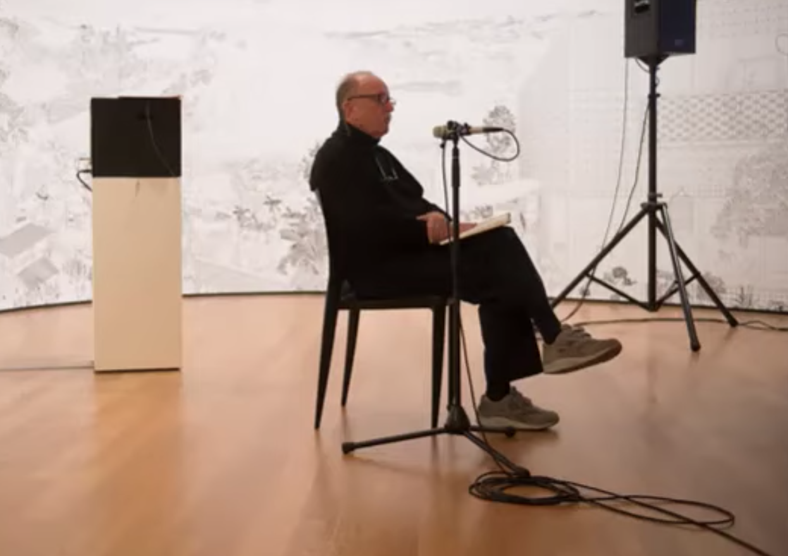
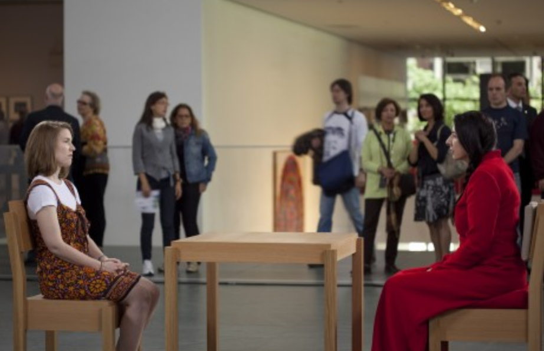

# Assignments for week 1

## Reading assignments

- Dreyfus, H.L. (2001): "Disembodied Telepresence and the Remoteness of the Real." In: ibid., *On the Internet.* Thinking in Action-series (pp.50-72). New York, NY:Routledge. 

!!! Info 
    This work is [obtainable via the RuG-library](https://rug.on.worldcat.org/detailed-record/55522651?databaseList=638&scope=wz:6544), but only in physical form (which, given the title of the chapter, is revealing). Try to get a copy but I won't hold it against you if you didn't succeed.
    
    I've provided [a scan of my own copy](../files/dreyfus_2001.pdf) (pdf, 7.2MB). This contains a few marginalia, but you're free to ignore that.

- Rucker, Rudy (2006): "Panpsychism proved. Met with stony silence." In: *Nature* (439), p.508. 

!!! Info
    You can easily find it on the internet, but [here's a copy for easy reference](../files/Rucker_2009.pdf).

## Study assignments

Study assignments are meant to create an understanding of the possibilities that emerge when art and technology coincide. During the course, you are asked to come up with your own examples of art-works (in the broadest sense possible) that illustrate the ideas and concepts that emerge from the literature and from the discussions.

Please have a look at the works below and think about how these relate to the literature. Also, try to find similar works that appeal to this theme.

### I am sitting in a room

Study [the description of this piece by Alvin Luciers](https://www.moma.org/explore/inside_out/2015/01/20/collecting-alvin-luciers-i-am-sitting-in-a-room/) that you can find at the MoMa-learn site. There are several performances of this work easily findable on the internet (youtube), but [this is the version that MoMa uses](https://www.youtube.com/watch?v=bhtO4DsSazc). As you can observe, this is a radical technological driven piece in which the performer only *starts* the sequence. 

**Questions**

1. If you think about musical performances, how much weight is put into the actual performer? Can you think of a difference in this regards between popular and more classical music performances?

2. Have a look at [the more contemporary variations on this theme](https://en.wikipedia.org/wiki/I_Am_Sitting_in_a_Room#In_popular_culture). Can you come up with other ideas on this theme?

### The artist is present

Have a look at [this TED Talk by Marina Abramović](https://www.youtube.com/watch?v=M4so_Z9a_u0). In it, she talks about the uniqueness of performance art and the necessitity of the public being present (no performance art can do without public). She also states that music is *the best art form as it has not physical manifestation at all*. Though one could make an argument that this is not completely true, why, do you think, does she think that that aspect important for (the quality of) artworks? (We will talk about music at lenght during this whole caput and at session number 8.)

Also study [this discription of a performance art by Abramović](https://www.moma.org/learn/moma_learning/marina-abramovic-marina-abramovic-the-artist-is-present-2010/) at the MoMa. We will talk about this work at length during this week's session.

**Questions**

1. Abramović' work has everything to do with 'love and trust'. You can easily see how this works in the case of the bow and arrow, or in the case with the knives and thorns. Can you explain why the same 'love and trust' in involved in her performance *The Artist is Present*?

2. *The Artist is Present* was performed in 2010. In the talk, Abramović states that if the work was done ten to fifteen years ago, it would not have been possible. Why do you think she thinks this is the case? Do you agree with her analysis?

3. What is the role of love and trust in artworks in general and in your own artistic practice? 

### Photobot

The last example of art-works that play with presence is [RoboPhot](https://www.robophot.com/). This contraption, made by [Daniel Boschung](https://www.danielboschung.com/daniel-boschung/) uses a high-resulution camera mounted on a  robot-arm to make *very* detailed photographs of all kinds of things (from humans to insects to art works). In this manner, details become apparent that are otherwise hidden from sight.

**Questions**

1. In personal communication, Boschung stated that his photographs show 'how reality really *is*'.What do you think of this statement? Is reality the real world that is hidden from plain sight? Is the scientific description of reality more *real* than the day-to-day world we experience?

2. Can you relate this work to Dreyfus' analysis of Descartes' conclusion that 'we are never present to the world or even our own bodies'? 

3. Do you have examples (e.g. from your own artistic practice) in which something that cannot be sensed is made visible, audible, touchable, ...? 

