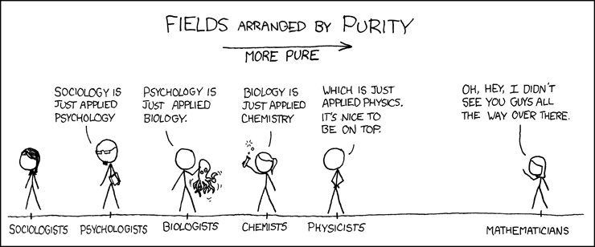

# Chapter 1: Presence 

In this first week, we will introduce the framework on which the caput selectum is build and open some first discussions through a round of introductions so we can get to know each other better. We will give a broad overview of the subject matters that will pass in the whole of the module, discuss the assignment and the theory of artistic research. 

Next, we will talk about the scientific world view that emerged as a result of the invention of the microscope. We will see that this had a profound impact of the way we percieve the arts and how we think about truth, the world, and ourselves. All this leads to the notion of man as a rational detached observer. 

All this has led to a worldview in which only scientific knowledge is *real knowledge* – knowledge in which the role of the human observer or participant is abstracted away en that only states something about *facts*. The more abstract, the better the science and its resulting knowledge is, as is nicely illustrated by this [little comic by xkcd](https://xkcd.com/435/):

This *scientific metaphysics* makes a sharp distinction between things of the *mind* and things of the *world* – exactly the same distinction Descartes made. Things of the first category are individual, private, emotional, subjective and should not (according to this metaphysics) play any role in real, scientific discourse about how the world *really is*.

By stating that personal, emotional and subjective feelings are only things of the *mind* we can conclude that those kind of feelings occur only in the mind – that our *sense of self*, our sense of *presence* is located in our *mind*. By seeing, as Descartes did, our sense organs as transducers of stimuli to our brain and from their to our mind, we open the possibility of replacing these sense organs with (technological) artifacts that transduce the same things – or different things. In this metaphysics, we can imagine our sense organs being completely replaced by something else, which would give us a completely different sense of *presence*:

<video style="width:40vw;" controls >
  <source src="https://www.bartbarnard.nl/media/strange_days.ogg" type="video/ogg">
Your browser does not support the video tag.
</video>

## Corporeality of knowledge

In order to get to grips to our presence, we need to ask ourselves the question *Where am I?*. This, however, will prove to be a rather difficult question to answer. When we approach this question from different perspectives (arts, sports, music, ...) we shall discuss the corporeality of our presence - and, by extension, of our knowledge.

During the sesion, we will use examples from philosophy and different artforms to make a point that our sense of presence is fundamentally *embodied*, and that the introduction of a strict dichotomy between mind and world is unfeasable in the end. Even if it were possible to replace the sense organs with technological artifacts, we would still not be only mind: not only will at least those artifacts have a *physical manifestation*, but we still would need some bodily experience in order to make sense of what those transducers are transducing.

All this leads to the idea of the *corporeality of knowledge*: the view that *real knowledge* is not only abstract scientific knowledge, but that also bodily subjective knowledge can appeal to *real-ness*. This is especially the case when we are *coping* in a *skillfull manner* with the tools we use in order to do our daily labour. 

<!--
## Plannning

- 09:00 - 10:00: onboarding – getting to know each other and the form of the course
- 10:00 - 11:00: talk and discussion on the (emergence of) the scientific world view
- 11:00 - 12:00: break 
- 12:00 - 13:00: on the corporality of knowledge
- 13:00 - 14:00: the role of media in the formation of knowledge
-->