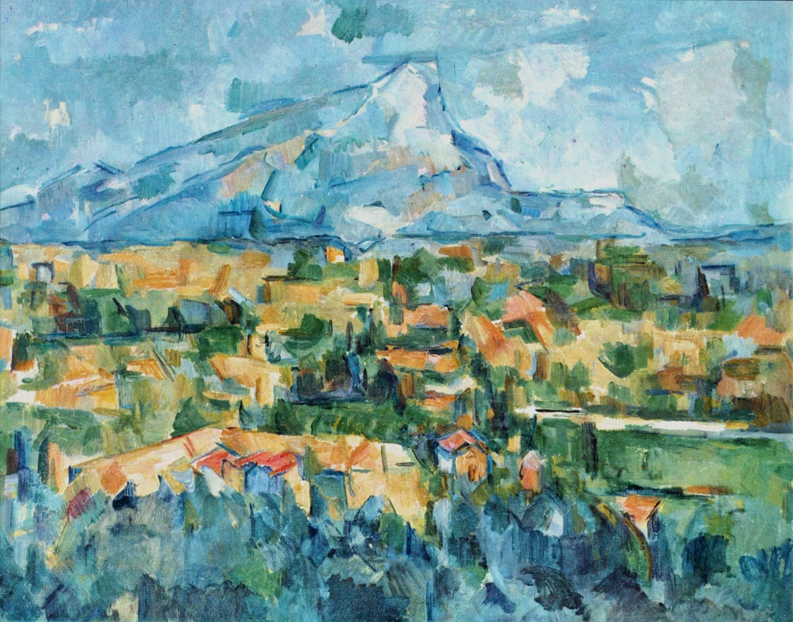
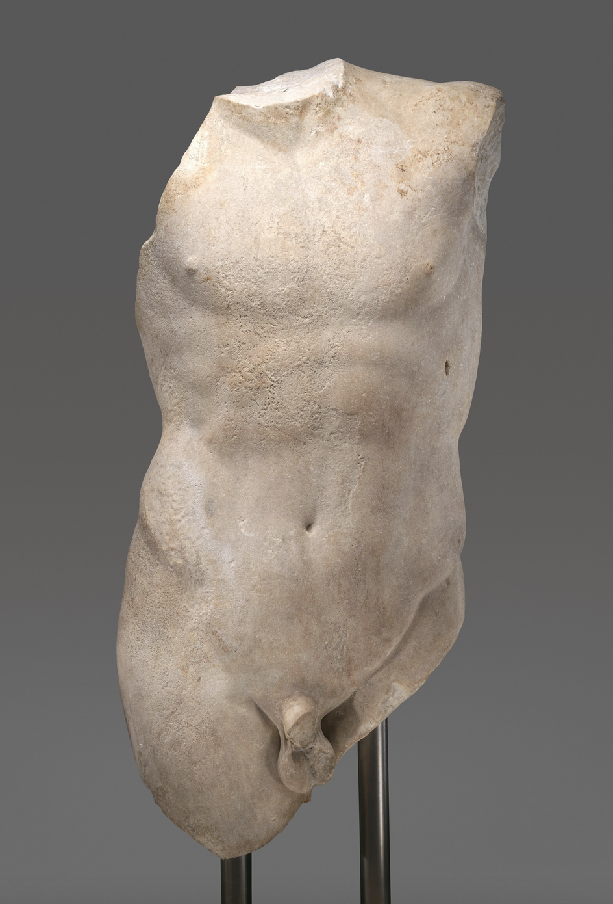
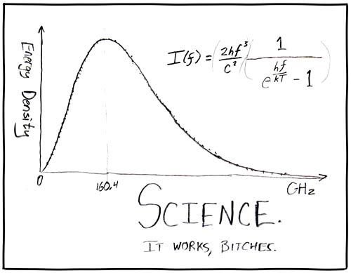
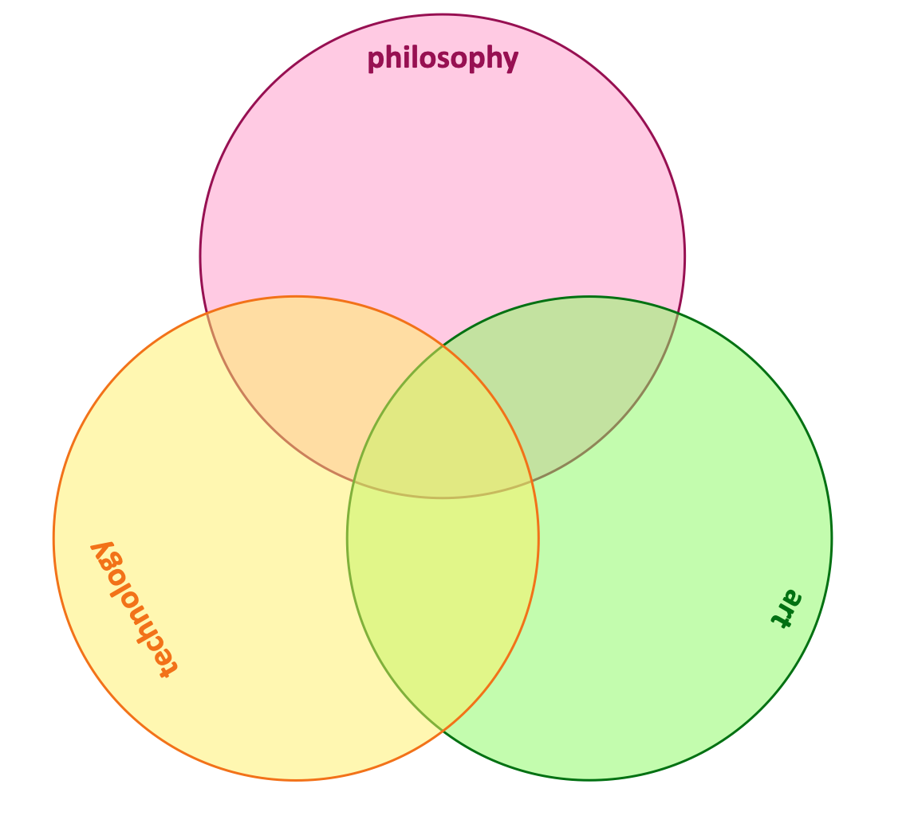
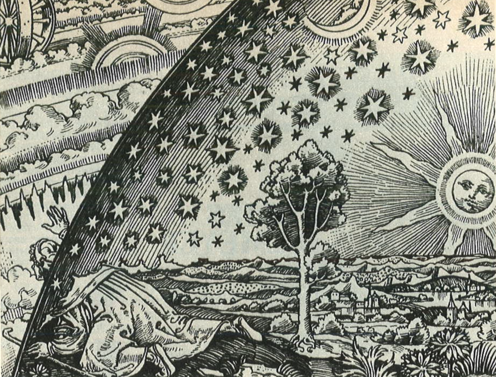

# Preface

## Du mußt dein Leben ändern

In 1907, the famous German poet [Reiner Maria Rilke](https://en.wikipedia.org/wiki/Rainer_Maria_Rilke), who was at the time living in Paris, made a habit of visiting the [Grand Palais on the Champ-Elysées](https://en.wikipedia.org/wiki/Grand_Palais). Here, he encountered the works of the painter Paul Cézanne, who had died the previous year.  Rilke feels a strong connection with the painter. Not only do both have a very strong work ethic, but the subjects that Cézanne is painting show Rilke that everything is worth to be painted. 

Cézanne made a point of letting the objects he painted talk for themselves. No prejudice should influence the work of the painter, no emotion should enter the painting, no intention should be clear to the viewer. Cézanne struggled to develop an authentic observation of the seen world by the most accurate method of representing it in paint that he could find. He did want to let the colors speak for themselves; not to paint the visible, but to paint visibility.

This experience taught Rilke that also in poetry the challenge is to have the words speak for themselves; not to make a poem *about* something, but to have the poem be a poem in its own regard. A poem should not describe something that is already there, but instead bring the not-present into being. 

When gazing upon the torso of Apollo a year later, a statue that is missing the head, arms and legs, this experience led to one of Rilke's most famous works:

=== "Deutsch"

    >Wir kannten nicht sein unerhörtes Haupt, 
    >darin die Augenäpfel reiften. Aber 
    >sein Torso glüht noch wie ein Kandelaber, 
    >in dem sein Schauen, nur zurückgeschraubt, 
    
    >sich hält und glänzt. Sonst könnte nicht der Bug 
    >der Brust dich blenden, und im leisen Drehen 
    >der Lenden könnte nicht ein Lächeln gehen 
    >zu jener Mitte, die die Zeugung trug. 
    
    >Sonst stünde dieser Stein entstellt und kurz 
    >unter der Schultern durchsichtigem Sturz 
    >und flimmerte nicht so wie Raubtierfelle; 
    
    >und bräche nicht aus allen seinen Rändern 
    >aus wie ein Stern: denn da ist keine Stelle, 
    >die dich nicht sieht. Du mußt dein Leben ändern. 

=== "English"

    >We cannot know his legendary head 
    >with eyes like ripening fruit. And yet his torso 
    >is still suffused with brilliance from inside, 
    >like a lamp, in which his gaze, now turned to low, 
    
    >gleams in all its power. Otherwise 
    >the curved breast could not dazzle you so, nor could 
    >a smile run through the placid hips and thighs 
    >to that dark center where procreation flared. 
    
    >Otherwise this stone would seem defaced 
    >beneath the translucent cascade of the shoulders 
    >and would not glisten like a wild beast's fur: 
    
    >would not, from all the borders of itself, 
    >burst like a star: for here there is no place 
    >that does not see you. You must change your life. 

    (Translated by [Stephen Mitchell](https://www.goodreads.com/book/show/49458.Ahead_of_All_Parting))

From the seconds strophe on, Rilke writes in the conjunctive – a form used to talk about unreal things (a subtle grammatical trick that is lost in the English translation). The missing parts of the torso are described as if they are still there; the metaphores used in the poem make the not-present present again. And to let the not-present speak for themself it appeals to us: it forces us to think about ourselves and our lifes.

## The artist as a signpost to the future

Good art appeals to us, as is evident from the famous last sentence of Rilke's poem. Like the paintings of Cézanne, the classical sculptures, the poems by Homer or Rilke, the opera's of Verdi or Auber, artworks show us an ideal wich which to compare our daily existence. The promise of happiness that Stendhall is attributing to beauty makes us gravitate towards beautiful things, makes that we want to be in their vicinity, makes that we go through some trouble to re-visit them once they are gone. 

Good artworks make us question our ideas, enhance our thoughts and make us forget ourselves. They open up possibilities, make implicit societal junctions explicit and show us how reality could be. And only once the possible is made visible can we start the work to make this possible real. That is why Heidegger could state that the *possible* is higher than the *real* (*Die Möglichkeit ist höher als die Wirklichtkeit*, ZS:§15).

Thiry years before Rilke, in the second book of his Human, All-too-human (*Menschliches, Allzumenschliches*, HH), Friedrich Nietzsche already describes the role of the coming artists as ‘signposting the future’ (*Wegweiser für die Zukunft*, HHII,99). According to him, artists are not to re-create reality in painting, sculpture, or in music. Their goal should be to become ‘sculptors and re-modelers of life’, the ‘teachers of adults (*Um- und Fortbildner des Lebens*, *Lehrer der Erwachsenen*, HHII, 172). The artists are to dedicate their powers to “emulate the artists of earlier times who imaginatively developed the existing images of the gods and imaginatively develop a beautiful image of man” (HHII, 99).  

Artists, Nietzsche seems to state, need to stand in the middle of our modern (scientific, technological) reality, think about possible future developments from this current situation and select possible realities in which “the beautiful soul is still possible” (ibid.). In selecting these realities, artists give them a visibility and a durability; they are raised to “the status of a model and in so doing help to create the future” (ibid; cf. Young, 1992, pp.73ff.). 

## Art and Technology

The works of the artists point the way to future technological developments; they envisage a *possibility* that can become a *reality* through scientific research and technological innovation. In this sense, art and technology form a unity again (*das Wissen und die Kunst zu neuer Einheit zusammengeflossen*, HHII, 99). 

This unity is counter-intuitive for a lot of people. We moderns (sure, [we have never been modern](https://fr.wikipedia.org/wiki/Nous_n%27avons_jamais_%C3%A9t%C3%A9_modernes), but still) tend to view art and technology as separate fields of human andeavour, and philosophy as some vague enterprise that has litte to do with either and surely nothing with everyday life. When pressed, most people would argue that science is the sole foundation of truth; only facts that are quantifyable, scientificly proven, and repeatable are *real* and that the engineering and technology form the physical manifestation of this reality.

However, before modern times, these fields of knowledge formed one complete whole, the word 'Art' in singular and with a capital A emerging only in the wake of [the Scientific Revolution](https://en.wikipedia.org/wiki/Scientific_Revolution). This whole was at center stage for most of the historical period. On this stage, art, technology and philosophy danced together in mutual harmony in order to explain and predict natural phenomena, to create and develop understanding, and to keep order in the world.

And even today, most fruitful and interesting ideas come from the intersection of these fields: technology [needs creativity as much as it needs science](https://www.infoq.com/articles/great-engineer-needs-liberal-arts/), a lot of [contemporary art-works](https://www.studioroosegaarde.net/stories) can only exist thanks to (digital) technology, and philosophy needs to think about both fields if it is to be true to Hegel's definition as 'ihre Zeit in Gedanken erfasst'. 

When we radicalize the idea of *l'art-pour-l'art*, anything can become an artwork and we loose the critical and creative reflection on society. In the same vain, technology left on its own becomes a force that determines our future without any scruples and no reference to ethics, history or tradition. And likewise, philosophy for philosophy's sake becomes a completely endoscopic enterprise: nice and interesting for a few people, but without any practical repercussion. That is why Dutch artist [Katinka Simonse](https://www.tinkebell.com/) [could state that](https://www.vpro.nl/speel~WO_VPRO_16603321~de-menselijke-natuur-6-voorbij-de-natuur~.html): "An artist is a philosopher that finishes the work.".

## Investigation

In the following chapters, we will investigate some of the consequences that arise when we reintroduce the unity between Nietzsche's *das Wissen und die Kunst*. We will look at artworks and listen to sounds that are only possible thanks to scientific knowledge and technical engineering, and we will see technological innovations that came into being only after an artist had thought about it. And as a scientific current under all these examples, we will follow the philosophical / ethical / societal discussions that are both cause and result of this interaction between art and technology.

We do this by looking at this subject from eight different perspectives. Every perspective sheds a new and different light on the subject manner, and it is our hope that at the end participants will have a thorough understanding of the relationship between art and technology (and some philosophy as a bonus). It is also our hope that participants will have find as much pleasure in participating as we had in creating.

